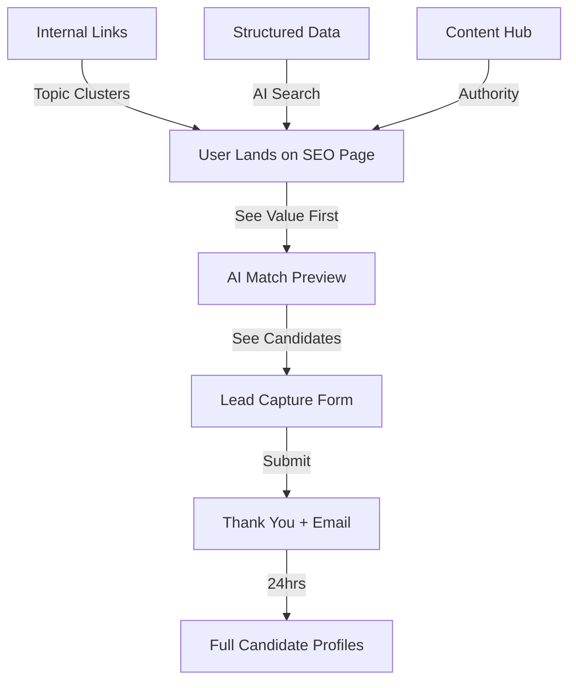
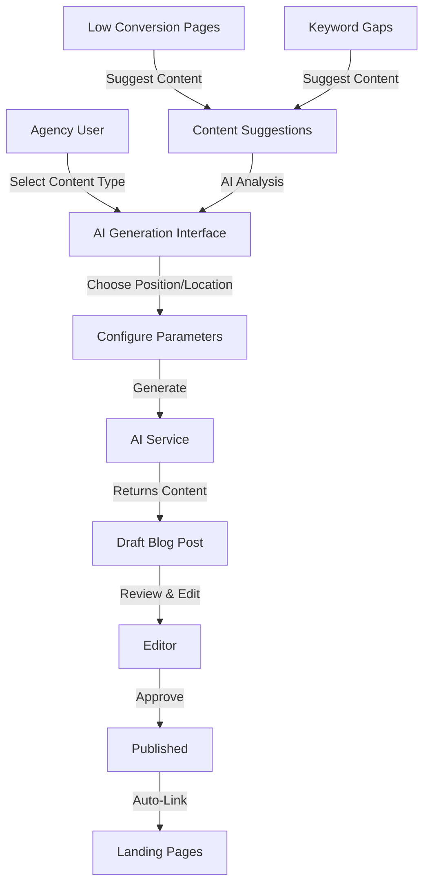

# SEO & Conversion Optimization Plan for Landing Pages

## Executive Summary

Transform "hire a [position] in [location]" pages from basic lead capture to high-converting, AI-optimized experiences that:

1. **Integrate match page funnel** - Show real candidate previews before asking for contact info
2. **Optimize for AI/LLM search** - Enhanced structured data, semantic HTML, comprehensive content
3. **Build internal linking strategy** - Create content hubs and topic clusters
4. **Improve conversion rates** - Progressive disclosure, value-first approach

## Current State Analysis

**Problems:**

- Basic inquiry form doesn't show value before asking for contact
- Limited structured data for AI search engines
- No internal linking strategy
- Low conversion rates (users don't see what they're getting)
- Missing trust signals and social proof

**Opportunities:**

- Match page has proven conversion mechanism (shows candidates first)
- Rich structured data already exists but can be enhanced
- Thousands of pages = massive internal linking potential
- AI search optimization is still early - can dominate

## URL Preservation Strategy

**Critical:** All existing URLs must continue to work without any changes or redirects.

### Current URL Structure

- **Existing Landing Pages:** `hire-a-[position]-[country]/[state]/[city]`
- Example: `hire-a-butler-australia/new-south-wale/sydney-2`
- Stored in `seo_landing_pages.original_url_path`
- Handled by catch-all route: `apps/web/app/(public)/[...catchAll]/page.tsx`
- **Status:** ✅ These URLs will continue to work exactly as they do now
- **New Blog Posts:** `/blog/[slug]`
- Example: `/blog/complete-guide-hiring-butler-sydney`
- **Status:** ✅ New content, doesn't conflict with existing URLs
- **New Hub Pages:** `/hire-a-[position]` and `/hire-in-[location]`
- Example: `/hire-a-butler` or `/hire-in-sydney`
- **Status:** ✅ New routes, don't conflict with existing `hire-a-*-*` pattern

### URL Preservation Guarantees

1. **No URL Changes:**

- All existing landing page URLs remain unchanged
- No redirects needed
- No URL rewrites
- Existing URLs continue to resolve via `original_url_path` lookup

2. **Route Priority:**

- Next.js route priority ensures existing routes work:

    1. Static routes (e.g., `/blog`) - highest priority
    2. Dynamic routes (e.g., `/blog/[slug]`) - medium priority
    3. Catch-all routes (e.g., `[...catchAll]`) - lowest priority (catches everything else)

- This means `hire-a-*` URLs continue to be caught by `[...catchAll]`

3. **Database Lookup:**

- Existing pages: Lookup by `original_url_path` in `seo_landing_pages` table
- Blog posts: Lookup by `slug` in `blog_posts` table
- No conflicts - different tables, different lookup fields

4. **Internal Linking:**

- Blog posts link TO existing landing pages using `original_url_path`
- Landing pages link TO blog posts using `/blog/[slug]`
- Hub pages link TO existing landing pages using `original_url_path`
- All links preserve existing URL structure

### Implementation Checklist

- [ ] Verify catch-all route handles all existing URL patterns
- [ ] Test existing URLs still resolve correctly
- [ ] Ensure blog routes don't conflict with existing patterns
- [ ] Add URL monitoring to track 404s and broken links
- [ ] Set up redirects ONLY if URLs need to change (not in this plan)
- [ ] Update sitemap to include both existing pages and new blog posts
- [ ] Monitor search console for URL errors after deployment

### URL Monitoring & Maintenance

**File:** `apps/web/app/api/seo/url-health/route.ts` (new)

- Periodic check of all `original_url_path` values
- Verify pages still resolve correctly
- Alert on any 404s from existing URLs
- Track URL performance metrics

**File:** `apps/web/app/api/seo/url-migration/route.ts` (future - if needed)

- Only use if URLs need to change in the future
- Handles bulk URL updates with redirects
- Preserves SEO value during migration
- Not needed for current plan (we're adding, not changing)

## Strategy Overview



## Implementation Plan

### Phase 1: Enhanced SEO Landing Page Component

**File:** `apps/web/components/seo/HireLandingPage.tsx`

**Key Changes:**

1. **Add AI Match Preview Section** (above the fold, before form)

- Pre-populate match query: "Hire a [position] in [city/state/country]"
- Show 2-3 anonymized candidate previews (from match API)
- "View [X] more candidates" CTA → opens match page with pre-filled query
- Builds trust and shows value before asking for contact

2. **Progressive Conversion Flow**

- **Option A (Low Intent):** "See More Candidates" → Match page
- **Option B (High Intent):** "Get Full Profiles" → Lead capture form
- Both paths tracked for conversion optimization

3. **Enhanced Structured Data**

- Add `HowTo` schema for hiring process
- Add `Review` schema with client testimonials
- Add `VideoObject` schema if video content exists
- Add `Article` schema for blog content links
- Enhanced `Service` schema with more AI-friendly fields

4. **Internal Linking Strategy**

- Related positions section: "Also hiring: [Chef, Butler, Estate Manager]"
- Related locations section: "Also serving: [Nearby cities/states]"
- Content hub links: "Learn more: [Salary guides, Hiring guides, Case studies]"
- Breadcrumb navigation with clickable hierarchy

### Phase 2: AI/LLM Search Optimization

**File:** `apps/web/components/seo/StructuredData.tsx`

**Enhancements:**

1. **Comprehensive FAQ Schema**

- Expand from 4 to 10-15 questions
- Include position-specific questions
- Location-specific questions
- Pricing/process questions
- All answers in natural language (AI-friendly)

2. **HowTo Schema** (Hiring Process)
   ```json
   {
     "@type": "HowTo",
     "name": "How to Hire a [Position] in [Location]",
     "step": [
       {"@type": "HowToStep", "name": "Share Requirements", ...},
       {"@type": "HowToStep", "name": "Review Matched Candidates", ...},
       {"@type": "HowToStep", "name": "Interview & Hire", ...}
     ]
   }
   ```

3. **Review/AggregateRating Enhancement**

- Add individual review schemas
- Position-specific ratings
- Location-specific testimonials

4. **Article/BlogPost Schema**

- Link to related blog posts
- "Hiring a [Position] Guide"
- "Salary Guide for [Position] in [Location]"
- "Interview Questions for [Position]"

5. **LocalBusiness Enhancement**

- Add `areaServed` with detailed geographic data
- Add `hasOfferCatalog` for different positions
- Add `priceRange` for transparency

### Phase 3: Internal Linking Architecture

**Database Schema Addition:**

**File:** `supabase/migrations/054_seo_internal_linking.sql`

```sql
-- Related pages table for internal linking
CREATE TABLE seo_page_relationships (
  id UUID PRIMARY KEY DEFAULT gen_random_uuid(),
  page_id UUID REFERENCES seo_landing_pages(id),
  related_page_id UUID REFERENCES seo_landing_pages(id),
  relationship_type TEXT CHECK (relationship_type IN ('same_position', 'same_location', 'related_position', 'related_location')),
  priority INTEGER DEFAULT 0,
  created_at TIMESTAMPTZ DEFAULT now()
);

-- Content hub links (blog posts, guides, etc.)
-- Links blog posts to existing landing pages using original_url_path
CREATE TABLE seo_content_links (
  id UUID PRIMARY KEY DEFAULT gen_random_uuid(),
  page_id UUID REFERENCES seo_landing_pages(id),
  landing_page_url TEXT, -- original_url_path from seo_landing_pages (e.g., "hire-a-butler-australia/new-south-wale/sydney-2")
  blog_post_id UUID REFERENCES blog_posts(id),
  content_type TEXT CHECK (content_type IN ('blog_post', 'salary_guide', 'hiring_guide', 'case_study', 'faq')),
  title TEXT NOT NULL,
  url TEXT NOT NULL, -- Full URL or relative path
  description TEXT,
  priority INTEGER DEFAULT 0,
  created_at TIMESTAMPTZ DEFAULT now(),
  -- Ensure we have either landing_page_url or blog_post_id
  CONSTRAINT seo_content_links_target_check CHECK (
    (landing_page_url IS NOT NULL) OR (blog_post_id IS NOT NULL)
  )
);
```

**Component:** `apps/web/components/seo/InternalLinking.tsx`

Features:

- **Related Positions Section**
- "Also hiring: [Chef, Butler, Estate Manager] in [Location]"
- Auto-generated based on position taxonomy
- Links to other landing pages using `original_url_path` format
- Example: Links to `hire-a-chef-australia/new-south-wale/sydney-2`

- **Related Locations Section**
- "Also serving: [Nearby cities/states]"
- Geographic proximity algorithm
- Links to location-specific pages using `original_url_path` format
- Example: Links to `hire-a-butler-australia/new-south-wale/melbourne-2`

- **Content Hub Links**
- **For Employers:**
    - "Salary Guide for [Position] in [Location]"
    - "Complete Guide to Hiring a [Position]"
    - "Interview Questions for [Position]"
    - "What to Look for in a [Position]"
- **For Candidates:**
    - "What Does a [Position] Do?"
    - "Career Path for [Position]"
    - "Skills Required for [Position]"
- Links to blog posts (`/blog/[slug]`)
- Blog posts link back using `original_url_path` format
- Filter content by target audience on landing pages

- **Topic Cluster Navigation**
- Position hub: `/hire-a-[position]` (aggregates all existing location pages)
- Location hub: `/hire-in-[location]` (aggregates all existing position pages)
- Hub pages list existing pages using `original_url_path` format
- Creates content silos for SEO authority while preserving existing URLs

### Phase 4: Match Page Integration

**New Component:** `apps/web/components/seo/MatchPreview.tsx`

Features:

1. **Pre-populated Match Query**

- Auto-generate: "Hire a [position] in [city, state, country]"
- Call `/api/public/brief-match/` with pre-filled query
- Show top 2-3 candidates (anonymized)

2. **Candidate Preview Cards**

- Match score badge
- Key highlights (experience, languages, availability)
- "View Full Profile" CTA (requires lead capture)

3. **Conversion Paths**

- **Path A:** "See [X] More Candidates" → `/match?query=[pre-filled]`
- **Path B:** "Get Full Profiles" → Lead capture modal
- Track which path converts better

4. **Fallback State**

- If no matches: "Our team can help find the perfect candidate"
- Show value proposition
- Lead capture form

**API Enhancement:** `apps/web/app/api/public/brief-match/route.ts`

- Add `preview_mode` parameter (returns limited results)
- Cache results for common queries
- Optimize for fast response times

### Phase 5: AI Blog Post Generation & CMS

**Database Schema:**

**File:** `supabase/migrations/055_blog_posts.sql`

```sql
-- Blog posts table for AI-generated content
CREATE TABLE blog_posts (
  id UUID PRIMARY KEY DEFAULT gen_random_uuid(),

  -- Content
  title TEXT NOT NULL,
  slug TEXT NOT NULL UNIQUE,
  excerpt TEXT,
  content TEXT NOT NULL, -- Markdown or HTML
  meta_title TEXT,
  meta_description TEXT,

  -- SEO & Targeting
  target_position TEXT, -- e.g., "butler", "chef"
  target_location TEXT, -- e.g., "sydney", "new-york"
  target_keywords TEXT[], -- Array of keywords
  primary_keyword TEXT, -- Main keyword for SEO

  -- Content Type & Template
  content_type TEXT CHECK (content_type IN (
    -- Employer-focused content
    'hiring_guide', -- "Complete Guide to Hiring a [Position]"
    'salary_guide', -- "Salary Guide: [Position] in [Location]"
    'interview_questions', -- "Top Interview Questions for [Position]"
    'what_to_look_for', -- "What to Look for in a [Position]"
    'onboarding_guide', -- "Onboarding Your New [Position]"
    'retention_strategy', -- "Retaining Top [Position] Talent"
    'legal_requirements', -- "Legal Requirements for Hiring [Position] in [Location]"
    -- Candidate-focused content
    'position_overview', -- "What Does a [Position] Do? Job Description"
    'career_path', -- "Career Path for [Position]"
    'skills_required', -- "Skills Required to Become a [Position]"
    'certifications', -- "Certifications for [Position]"
    -- General content
    'location_insights', -- "Hiring [Position] in [Location]: Market Insights"
    'case_study', -- "Success Story: Finding a [Position] in [Location]"
    'faq_expansion' -- Extended FAQ content
  )),
  target_audience TEXT CHECK (target_audience IN ('employer', 'candidate', 'both')) DEFAULT 'both',
  template_type TEXT, -- Template used for generation

  -- AI Generation Metadata
  ai_model TEXT, -- e.g., "gpt-4", "claude-3"
  ai_prompt TEXT, -- Prompt used for generation
  generation_params JSONB, -- Temperature, max_tokens, etc.
  generated_at TIMESTAMPTZ,
  generated_by UUID REFERENCES users(id),

  -- Editorial Workflow
  status TEXT DEFAULT 'draft' CHECK (status IN (
    'draft',
    'ai_generated',
    'needs_review',
    'in_editing',
    'approved',
    'published',
    'archived'
  )),
  reviewed_by UUID REFERENCES users(id),
  reviewed_at TIMESTAMPTZ,
  published_at TIMESTAMPTZ,

  -- Internal Linking (using original_url_path for existing pages)
  related_landing_page_urls TEXT[], -- Array of original_url_path values (e.g., "hire-a-butler-australia/new-south-wale/sydney-2")
  related_blog_posts UUID[], -- Array of other blog_post IDs

  -- Analytics
  view_count INTEGER DEFAULT 0,
  engagement_score NUMERIC, -- Calculated from views, time on page, etc.

  -- Timestamps
  created_at TIMESTAMPTZ DEFAULT now(),
  updated_at TIMESTAMPTZ DEFAULT now()
);

-- Indexes for performance
CREATE INDEX idx_blog_posts_status ON blog_posts(status);
CREATE INDEX idx_blog_posts_position ON blog_posts(target_position);
CREATE INDEX idx_blog_posts_location ON blog_posts(target_location);
CREATE INDEX idx_blog_posts_published ON blog_posts(published_at DESC) WHERE status = 'published';
CREATE INDEX idx_blog_posts_slug ON blog_posts(slug);

-- Full-text search index
CREATE INDEX idx_blog_posts_search ON blog_posts USING gin(
  to_tsvector('english', coalesce(title, '') || ' ' || coalesce(content, '') || ' ' || coalesce(excerpt, ''))
);

-- RLS Policies
ALTER TABLE blog_posts ENABLE ROW LEVEL SECURITY;

-- Public can read published posts
CREATE POLICY "Public can read published blog posts"
  ON blog_posts FOR SELECT
  USING (status = 'published');

-- Authenticated users can manage posts
CREATE POLICY "Agency users can manage blog posts"
  ON blog_posts FOR ALL
  TO authenticated
  USING (true)
  WITH CHECK (true);
```

**AI Generation Service:**

**File:** `packages/ai/blog-generation/index.ts`

Features:

1. **Template-Based Generation**

- Pre-defined prompts for each content type
- Position/location-specific context injection
- SEO keyword optimization
- Internal linking suggestions

2. **URL Mapping to Existing Landing Pages**

- When generating blog post for position + location:
    - Query `seo_landing_pages` table by `position_slug` + location components
    - Find matching pages (e.g., `position_slug='butler'` + `city_slug='sydney-2'`)
    - Extract `original_url_path` (e.g., `hire-a-butler-australia/new-south-wale/sydney-2`)
    - Store in `related_landing_page_urls` array
    - Auto-generate internal links in blog content using these URLs
- Example workflow:
    - User generates: "Hiring Guide for Butler in Sydney"
    - System finds: `hire-a-butler-australia/new-south-wale/sydney-2`
    - Blog post includes: [Read more about hiring a butler in Sydney](/hire-a-butler-australia/new-south-wale/sydney-2)
- Preserves all existing URL structure

3. **Content Types:**

**Employer-Focused Templates:**

- **Hiring Guide:** "Complete Guide to Hiring a [Position] in [Location]"
    - Step-by-step hiring process
    - What to look for in candidates
    - Red flags to avoid
    - Best practices
- **Salary Guide:** "Salary Guide: [Position] in [Location] (2024)"
    - Market rates by experience level
    - Benefits expectations
    - Total compensation considerations
- **Interview Questions:** "Top 20 Interview Questions for [Position]"
    - Behavioral questions
    - Technical/skill questions
    - Situational scenarios
- **What to Look For:** "What to Look for in a [Position]: Essential Qualities"
    - Key skills and qualifications
    - Personality traits
    - Experience indicators
- **Onboarding Guide:** "Onboarding Your New [Position]: Best Practices"
    - First week checklist
    - Training requirements
    - Integration strategies
- **Retention Strategy:** "Retaining Top [Position] Talent: Retention Strategies"
    - Compensation strategies
    - Career development
    - Work-life balance
- **Legal Requirements:** "Legal Requirements for Hiring [Position] in [Location]"
    - Work permits/visas
    - Employment contracts
    - Local regulations

**Candidate-Focused Templates:**

- **Position Overview:** "What Does a [Position] Do? Complete Job Description"
    - Day-to-day responsibilities
    - Required skills
    - Career progression
- **Career Path:** "Career Path for [Position]: Advancement Opportunities"
    - Entry to senior levels
    - Skill development
    - Industry trends
- **Skills Required:** "Skills Required to Become a [Position]"
    - Hard skills
    - Soft skills
    - Training recommendations
- **Certifications:** "Certifications for [Position]: Professional Development"
    - Required certifications
    - Recommended training
    - Continuing education

**General Templates:**

- **Location Insights:** "Hiring [Position] in [Location]: Market Insights"
    - Market trends
    - Supply/demand
    - Local considerations
- **Case Study:** "Success Story: Finding a [Position] in [Location]"
    - Client testimonials
    - Process walkthrough
    - Results achieved
- **FAQ Expansion:** Extended FAQ content for landing pages
    - Common questions
    - Detailed answers
    - Related topics

4. **Generation Parameters:**

- Target word count (1500-3000 words)
- SEO keyword density
- Internal linking opportunities
- Structured data requirements
- Readability score targets

**CMS Interface:**

**File:** `apps/web/app/(main)/dashboard/seo-pages/blog/page.tsx`

Features:

1. **Blog Post List View**

- Filter by: status, content type, target audience (employer/candidate/both), position, location
- Sort by: date, views, engagement score
- Search by title, content, keywords
- Bulk actions: publish, archive, delete
- Visual indicators for target audience (badges/icons)

2. **AI Generation Interface**

- **File:** `apps/web/app/(main)/dashboard/seo-pages/blog/new/page.tsx`
- **Target audience selector:** Employer / Candidate / Both
- Content type selector (filtered by target audience)
- Position/location selector (auto-suggests from landing pages)
- Primary keyword input
- Target word count slider
- "Generate with AI" button
- Preview before saving
- Template preview (shows structure before generation)

3. **Blog Post Editor**

- **File:** `apps/web/app/(main)/dashboard/seo-pages/blog/[id]/page.tsx`
- Rich text editor (Markdown or WYSIWYG)
- SEO preview (title, description, URL)
- Internal linking tool (suggest related pages/posts)
- Status workflow: Draft → Review → Approved → Published
- Version history (optional)
- Preview mode

4. **Content Suggestions Dashboard**

- **File:** `apps/web/app/(main)/dashboard/seo-pages/blog/suggestions/page.tsx`
- AI-suggested blog topics based on:
    - Landing pages with low conversion
    - High-traffic landing pages missing content
    - Keyword gaps
    - Competitor analysis
    - Audience-specific gaps (employer vs candidate content)
- Filter by target audience (employer/candidate/both)
- One-click generation from suggestions
- Priority scoring (high/medium/low based on potential impact)

**API Routes:**

- `apps/web/app/api/blog-posts/route.ts` - List, create posts
- `apps/web/app/api/blog-posts/[id]/route.ts` - Get, update, delete
- `apps/web/app/api/blog-posts/[id]/generate/route.ts` - AI generation endpoint
- `apps/web/app/api/blog-posts/suggestions/route.ts` - Content suggestions
- `apps/web/app/api/blog-posts/[id]/publish/route.ts` - Publish workflow

**Public Blog Pages:**

- `apps/web/app/(public)/blog/page.tsx` - Blog listing
- `apps/web/app/(public)/blog/[slug]/page.tsx` - Individual post

**Integration with Existing Landing Pages:**

- **URL Mapping:** Blog posts link to existing URLs using `original_url_path` format
- Example: Blog post about "Hiring a Butler in Sydney" → links to `hire-a-butler-australia/new-south-wale/sydney-2`
- **Auto-linking Logic:**
- Match blog post `target_position` + `target_location` to `seo_landing_pages` records
- Use `original_url_path` for all internal links (preserves existing URL structure)
- Show "Related Articles" section on landing pages using existing URLs
- **Position Hub Pages:**
- URL: `/hire-a-[position]` (e.g., `/hire-a-butler`)
- Aggregates all existing pages with that position
- Links use `original_url_path` format
- **Location Hub Pages:**
- URL: `/hire-in-[location]` (e.g., `/hire-in-sydney`)
- Aggregates all existing pages for that location
- Links use `original_url_path` format
- **Backward Compatibility:**
- All existing URLs continue to work unchanged
- Blog posts enhance existing pages without breaking URLs
- Internal linking uses existing URL structure

**AI Blog Generation Workflow:**



**Content Generation Strategy:**

1. **Priority-Based Generation:**

- High-traffic landing pages → Generate 1-2 blog posts
- Low-conversion pages → Generate targeted content
- Keyword gaps → Generate to fill gaps

2. **Template Library:**

**Employer Templates:**

- Hiring Guide (2000-3000 words) - Complete hiring process
- Salary Guide (1500-2000 words) - Market rates and compensation
- Interview Questions (1000-1500 words) - Question bank with answers
- What to Look For (1500-2000 words) - Essential qualities and red flags
- Onboarding Guide (1500-2000 words) - Best practices for integration
- Retention Strategy (1500-2000 words) - Keeping top talent
- Legal Requirements (1000-1500 words) - Compliance and regulations

**Candidate Templates:**

- Position Overview (1500-2000 words) - Job description and responsibilities
- Career Path (1500-2000 words) - Advancement opportunities
- Skills Required (1200-1800 words) - Required and recommended skills
- Certifications (1000-1500 words) - Professional development

**General Templates:**

- Location Insights (1500-2000 words) - Market trends and local context
- Case Study (1500-2000 words) - Success stories
- FAQ Expansion (800-1200 words) - Extended Q&A content

3. **Quality Control:**

- AI generates → Human reviews → Edits → Publishes
- SEO optimization check before publishing
- Internal linking verification
- Readability score validation

### Phase 6: Content Strategy & Blog Integration

**New Pages to Create:**

1. **Position Hub Pages** (`/hire-a-[position]`)

- Overview of position
- Lists all existing landing pages for that position
- Links use `original_url_path` format (e.g., `hire-a-butler-australia/new-south-wale/sydney-2`)
- Blog posts about position (auto-populated)
- Example: `/hire-a-butler` shows all "hire-a-butler-*" pages

2. **Location Hub Pages** (`/hire-in-[location]`)

- Overview of location
- Lists all existing landing pages for that location
- Links use `original_url_path` format
- Example: `/hire-in-sydney` shows all pages with Sydney in the URL path
- Local market insights (from blog posts)

3. **Blog Post Auto-Generation Strategy**

**Content Mix:**

- **Employer-focused:** 60% of content
- Hiring guides (1 per high-traffic position)
- Salary guides (1 per position/location combo)
- Interview questions (1 per position)
- What to look for (1 per position)
- **Candidate-focused:** 30% of content
- Position overviews (1 per position)
- Career paths (1 per position category)
- Skills required (1 per position)
- **General:** 10% of content
- Location insights (top 20 locations)
- Case studies (5-10 success stories)
- FAQ expansions (as needed)

**Generation Priority:**

- Generate 1-2 employer-focused posts per high-traffic landing page
- Generate 1 candidate-focused post per position category
- Map generated posts to existing landing pages using `original_url_path`
- Generate hub content for each position (10-15 positions)
- Generate location insights for top 20 locations
- Total: ~150-250 AI-generated posts initially
- ~90-150 employer-focused
- ~45-75 candidate-focused
- ~15-25 general

**URL Mapping:** When generating for "Hire a Butler in Sydney":

- System finds: `hire-a-butler-australia/new-south-wale/sydney-2`
- Blog post links back to this existing URL
- Landing page links to new blog post
- Both employer and candidate content can link to same landing page

**Internal Linking Rules (Using Existing URLs):**

- **Landing Pages** (existing URLs like `hire-a-butler-australia/new-south-wale/sydney-2`):
- Link to position hub: `/hire-a-[position]` (e.g., `/hire-a-butler`)
- Link to location hub: `/hire-in-[location]` (e.g., `/hire-in-sydney`)
- Link to 2-3 related blog posts (auto-selected by position/location match)
- Link to 3-5 related landing pages using `original_url_path` format
- All links preserve existing URL structure

- **Blog Posts** (`/blog/[slug]`):
- Link to 3-5 relevant landing pages using `original_url_path` format
- Example: Links to `hire-a-butler-australia/new-south-wale/sydney-2`
- Link to related blog posts (same audience type preferred)
- Link to position/location hubs
- Show "Related for Employers" and "Related for Candidates" sections

- **Position Hub Pages** (`/hire-a-[position]`):
- Lists all existing landing pages for that position
- Links use `original_url_path` format
- Shows related blog posts

- **Location Hub Pages** (`/hire-in-[location]`):
- Lists all existing landing pages for that location
- Links use `original_url_path` format
- Shows related blog posts

- **URL Preservation:**
- All existing URLs remain unchanged
- New blog posts and hubs enhance existing structure
- No redirects needed (backward compatible)

### Phase 7: Conversion Optimization

**A/B Testing Framework:**

1. **Hero CTA Variations**

- "See Candidates Now" vs "Get Free Consultation"
- "View Matches" vs "Request Shortlist"

2. **Form Placement**

- Above fold vs below match preview
- Inline vs modal

3. **Value Proposition**

- Stats-first vs benefits-first
- Social proof placement

**Analytics Tracking:**

- Track match preview interactions
- Track which conversion path works best
- Track internal link clicks
- Track scroll depth and engagement

### Phase 8: URL Preservation & Monitoring

**Critical Implementation Steps:**

1. **Verify Existing Route Handling**

- **File:** `apps/web/app/(public)/[...catchAll]/page.tsx`
- Ensure catch-all route continues to work for all `hire-a-*` URLs
- Test with sample URLs from database
- Verify `original_url_path` lookup works correctly
- **No changes needed** - existing code already handles this

2. **Route Conflict Prevention**

- Blog routes: `/blog` and `/blog/[slug]` - don't conflict
- Hub routes: `/hire-a-[position]` and `/hire-in-[location]` - don't conflict
- Existing routes: `hire-a-*-*` pattern - handled by catch-all
- **Verification:** Test that new routes don't intercept existing URLs

3. **URL Health Monitoring**

- **File:** `apps/web/app/api/seo/url-health/route.ts` (new)
- Periodic check of all `original_url_path` values
- Verify pages resolve correctly
- Track 404 errors
- Alert on broken links

4. **Sitemap Updates**

- **File:** `apps/web/app/sitemap.ts`
- Include existing landing pages (already done)
- Add new blog posts
- Add new hub pages
- Ensure all URLs are in sitemap

5. **Search Console Monitoring**

- Monitor for URL errors after deployment
- Track indexing status of new blog posts
- Verify existing pages remain indexed
- Set up alerts for URL issues

### Phase 9: Technical SEO Enhancements

**File:** `apps/web/app/(public)/[...catchAll]/page.tsx`

1. **Enhanced Metadata**

- Add `keywords` meta tag (position + location variations)
- Add `author` meta tag
- Add `article:tag` for blog integration
- Add Open Graph enhancements

2. **Semantic HTML**

- Use proper heading hierarchy (H1 → H6)
- Use `<article>`, `<section>`, `<aside>` tags
- Use `<time>` tags for dates
- Use `<address>` for location data

3. **Performance Optimization**

- Lazy load match preview
- Optimize images (WebP, lazy loading)
- Prefetch related pages on hover
- Cache match results

4. **Accessibility**

- ARIA labels for all interactive elements
- Keyboard navigation
- Screen reader optimization

## Implementation Priority

### Week 1-2: Foundation

1. Update `HireLandingPage` component with match preview
2. Enhance structured data schemas
3. Create internal linking database tables

### Week 3-4: Content & Links

1. Build `InternalLinking` component
2. Create position/location hub pages
3. Generate related page relationships

### Week 5-6: AI Blog Generation & CMS

1. Create blog posts database schema
2. Build AI generation service
3. Create CMS interface (list, editor, generation)
4. Build public blog pages
5. Generate initial batch of blog posts

### Week 7-8: Optimization

1. A/B test conversion flows
2. Optimize performance
3. Add analytics tracking
4. Refine AI generation prompts based on performance

## Success Metrics

**SEO Metrics:**

- Organic traffic increase: +50% in 3 months
- AI search visibility: Top 3 for "hire [position] in [location]"
- Internal link click-through rate: >15%
- Average time on page: +30%

**Conversion Metrics:**

- Conversion rate: 2% → 5% (2.5x improvement)
- Match preview engagement: >60% of visitors
- Form completion rate: +40%
- Lead quality score: +25%

## Key Files to Modify

1. `apps/web/components/seo/HireLandingPage.tsx` - Main component overhaul
2. `apps/web/components/seo/StructuredData.tsx` - Enhanced schemas
3. `apps/web/components/seo/MatchPreview.tsx` - New component
4. `apps/web/components/seo/InternalLinking.tsx` - New component
5. `apps/web/app/(public)/[...catchAll]/page.tsx` - Metadata enhancements (NO URL changes - existing URLs preserved)
6. `supabase/migrations/054_seo_internal_linking.sql` - New tables
7. `apps/web/app/api/public/brief-match/route.ts` - Preview mode
8. `supabase/migrations/055_blog_posts.sql` - Blog posts table
9. `packages/ai/blog-generation/index.ts` - AI blog generation service
10. `apps/web/app/(main)/dashboard/seo-pages/blog/page.tsx` - Blog CMS list view
11. `apps/web/app/(main)/dashboard/seo-pages/blog/new/page.tsx` - AI generation interface
12. `apps/web/app/(main)/dashboard/seo-pages/blog/[id]/page.tsx` - Blog editor
13. `apps/web/app/(public)/blog/[slug]/page.tsx` - Public blog post page
14. `apps/web/app/api/seo/url-health/route.ts` - URL health monitoring (new)
